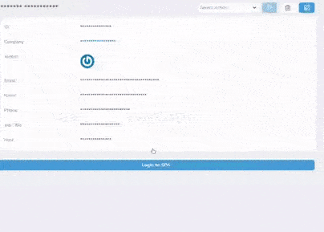

# Laravel Nova cross login tool

Laravel Nova resource tool that allows a user or other resource to log into an external control panel or application.



## Installation

```bash
composer require yaroslawww/nova-external-login
```

## Usage

### Nova Part

```injectablephp
ExternalLogin::make()
     ->setUniqueKey('ads-dashboard') // in case if you want add two different logins to same resource
     ->buttonTitle('Login to SPA')
     ->iframePath('/login-as')
     ->redirectPath('/home')
     ->postUrl('https://spa.mydomain.com')
     ->loginUsing(function (NovaRequest $request) {
         return Response::json([
         'data' => [
                 'access_token' => thereFunctionWillGenerateAndReturnToken($request),
                 // other params if need
             ]
         ], 201);
     }),
```

### SPA part

File should contain js something like this

```js
export default Vue.extend({
    // ...
    created() {
        window.addEventListener('message', (event) => {
            if (event.origin === this.$config.adminURL) {
                if (event.data && event.data.access_token) {
                    this.$store.dispatch('auth/setToken', event.data.access_token)
                    setTimeout(() => {
                        this.$store
                            .dispatch('auth/getProfile')
                            .then((response) => {
                                console.warn(response)
                                // Some data
                            })
                            .catch((error) => console.error(error))
                    }, 0)
                }
            }
        })
    },
    // ...
})
```

## Credits

- [](https://think.studio/)
